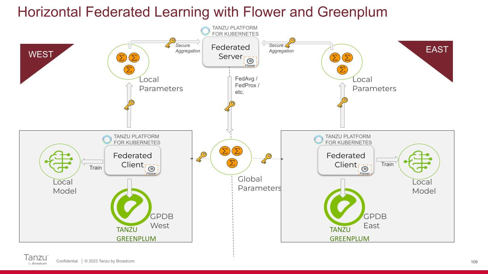

## Overview
Simple demonstration of cross-silo, horizontal federated learning with Greenplum clients and a centralized aggregation server based on the Flower framework.
Uses **FedAvg** algorithm.



## Run on Tanzu Platform for K8s
(Documentation in progress)

## Run locally
* Install pip dependencies:
```
pip install -r requirements.txt
```

* Run the following:
```
#!/bin/bash
set -e
cd "$( cd "$( dirname "${BASH_SOURCE[0]}" )" >/dev/null 2>&1 && pwd )"/

echo "Starting server"
python server.py &
sleep 10  # Sleep for 3s to give the server enough time to start

for i in $(seq 0 1); do
    echo "Starting client $i"
    python client.py --partition-id "${i}" &
done

# This will allow you to use CTRL+C to stop all background processes
trap 'trap - SIGTERM && kill -- -$$' SIGINT SIGTERM
# Wait for all background processes to complete
wait
```